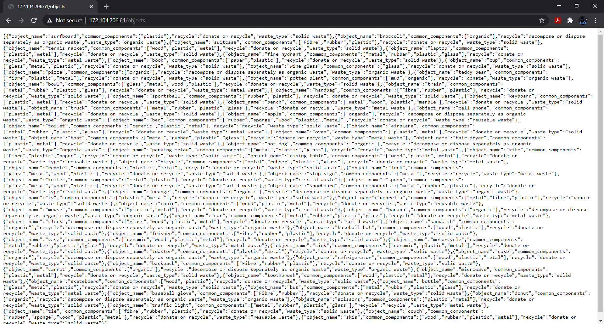
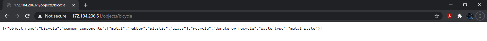

# tidy_api

a rest api that returns information about how to recycle things

## Usage

`/objects` Returns an array containing all objects
Use query parameters `page` and `pageSize` to optimise
the output.

`/objects/bicycle` Returns the information about bicycle

`/objects/bicycle/common_components` Return the information of common components of a bicycle
Other requests that can be made include:

* `object_name` returns object name
* `waste_type` what type of waste the object is
* `recycle` the best way to get rid of it

## Techstack

* Node.js
* Express.js
* Datastax Astra
* [Linode](172.104.206.61/objects)
* Firebase(Not deployed- had some errors with billing)

## Examples

